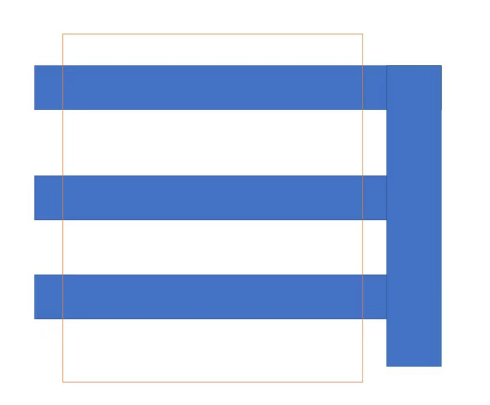
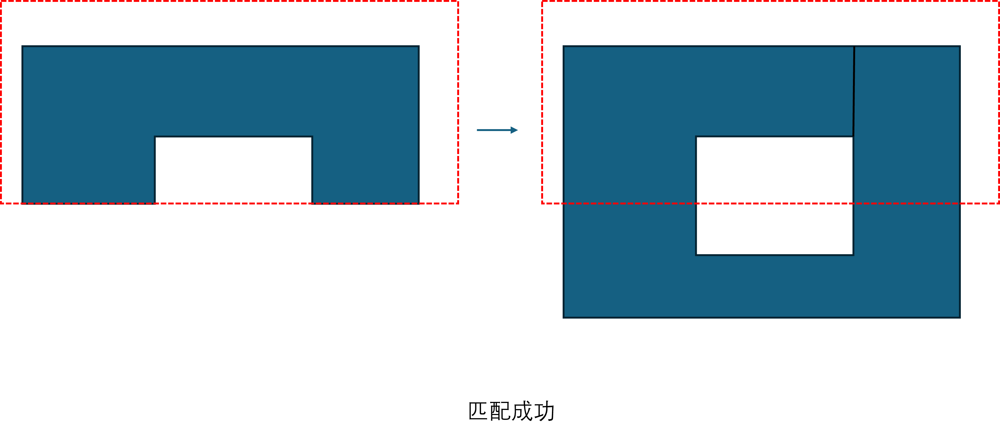

## 调用方式
- 下载 [boost_1_82_0.tar.bz2](https://www.boost.org/users/history/version_1_82_0.html)
- 解压
  ```
  tar --bzip2 -xf boost_1_82_0.tar.bz2
  ```
- 一般将解压后的整个boost_1_82_0文件夹存放在/usr/local目录下
  ```
  sudo cp -r boost_1_82_0 /usr/local
  ```
-  随后即可直接调用头文件，例如：
- 本赛题处理曼哈顿图形主要需要用到boost geometry库中的[model::polygon - 1.86.0 (boost.org)](https://www.boost.org/doc/libs/1_86_0/libs/geometry/doc/html/geometry/reference/models/model_polygon.html)模型，以及会涉及[model::d2::point_xy - 1.86.0 (boost.org)](https://www.boost.org/doc/libs/1_86_0/libs/geometry/doc/html/geometry/reference/models/model_d2_point_xy.html)和[model::multi_polygon - 1.86.0 (boost.org)](https://www.boost.org/doc/libs/1_86_0/libs/geometry/doc/html/geometry/reference/models/model_multi_polygon.html)，常用的头文件一般包括
  ```
  #include <iostream>
  #include <boost/geometry.hpp>
  #include <boost/geometry/geometries/point_xy.hpp>
  #include <boost/geometry/geometries/polygon.hpp>
  #include <boost/geometry/geometries/multi_polygon.hpp>
  ```
- 定义polygon变量类型可简化为：第一个参数表示点维度为2，第二个参数表示顶点顺序（默认为True，表示顺时针，可省略；本题采用逆时针，故改为False，不可省略参数！！！），第三个参数表示是否闭合（默认为True，可省略，在赋值时最后一个点与第一个点相同；本题描述规则不包含起始点，故改为False，参数不可省略！！！）
  ```
  typedef boost::geometry::model::polygon<boost::geometry::model::d2::point_xy<int>, 0, 0> polygon;
  ```
- 赋值，书写规则与define对应，例如
  ```
  polygon hole{{{0, 0},{10, 0},{10, 8},{8, 8},{8,2},{2,2},{2,6},{8,6},{8,8},{0,8}}};
  polygon marker{{{-1, 4},{11, 4},{11, 9},{-1, 9}}};
  ```
- 可使用dsv查看输出
  ```
  using boost::geometry::dsv;//这句好像要不要都行
        std::cout << dsv(hole) << std::endl;
  ```
- 下面介绍一些基本的运算
- 求交and [intersection - 1.86.0 (boost.org)](https://www.boost.org/doc/libs/1_86_0/libs/geometry/doc/html/geometry/reference/algorithms/intersection/intersection_3.html)
  ```
  // 先定义一个multi_polygon（案例中用的是std::deque<polygon>,但我感觉没必要）
  boost::geometry::model::multi_polygon<polygon> output;
  // 采用函数boost::geometry::intersection(polygon1, polygon2, output);
    	boost::geometry::intersection(hole, marker, output);
  ```
- 求并or [union_ - 1.86.0 (boost.org)](https://www.boost.org/doc/libs/1_86_0/libs/geometry/doc/html/geometry/reference/algorithms/union_/union__3.html)
- 把intersection换成union_
  ```
  boost::geometry::union_(hole, marker, output);
  ```
- 异或xor [sym_difference - 1.86.0 (boost.org)](https://www.boost.org/doc/libs/1_86_0/libs/geometry/doc/html/geometry/reference/algorithms/sym_difference/sym_difference_3.html)
- 
- 化简 [simplify - 1.86.0 (boost.org)](https://www.boost.org/doc/libs/1_86_0/libs/geometry/doc/html/geometry/reference/algorithms/simplify/simplify_3.html)
- 
- 求最小包围矩形MBR [envelope - 1.86.0 (boost.org)](https://www.boost.org/doc/libs/1_86_0/libs/geometry/doc/html/geometry/reference/algorithms/envelope/envelope_2.html)
- 
- 在使用c++命令编译运行.cpp文件时需加上-I path/to/boost_1_82_0
### example.cpp：
```cpp
#include <iostream>
#include <boost/geometry.hpp>
#include <boost/geometry/geometries/point_xy.hpp>
#include <boost/geometry/geometries/polygon.hpp>
#include <boost/geometry/geometries/multi_polygon.hpp>

int main()
{
    typedef boost::geometry::model::polygon<boost::geometry::model::d2::point_xy<int>, 0,0> polygon;
    polygon hole{{{0, 2},{8,2},{8,0},{10,0},{10, 10},{8,10},{8, 8},{0,8},{0,6},{8,6},{8,4},{0,4}}};
    polygon marker{{{2, 0},{6, 0},{6, 10},{2, 10}}};
	boost::geometry::model::multi_polygon<polygon> multi;
    	boost::geometry::intersection(hole, marker, multi);
    std::cout << "intersection:" << std::endl;
	using boost::geometry::dsv;
        std::cout << dsv(multi) << std::endl;
    return 0;
}
```
- 编译运行：
  ```
  c++ -I /usr/local/boost_1_82_0 example.cpp -o example
  ./example
  ```
- 输出：
```
intersection:
((((2, 4), (2, 2), (6, 2), (6, 4))), (((2, 6), (6, 6), (6, 8), (2, 8))))
```

### 功能
- 求交and [intersection - 1.86.0 (boost.org)](https://www.boost.org/doc/libs/1_86_0/libs/geometry/doc/html/geometry/reference/algorithms/intersection/intersection_3.html)
- 求并or [union_ - 1.86.0 (boost.org)](https://www.boost.org/doc/libs/1_86_0/libs/geometry/doc/html/geometry/reference/algorithms/union_/union__3.html)
- 异或xor [sym_difference - 1.86.0 (boost.org)](https://www.boost.org/doc/libs/1_86_0/libs/geometry/doc/html/geometry/reference/algorithms/sym_difference/sym_difference_3.html)
- 化简 [simplify - 1.86.0 (boost.org)](https://www.boost.org/doc/libs/1_86_0/libs/geometry/doc/html/geometry/reference/algorithms/simplify/simplify_3.html)
- 求最小包围矩形MBR [envelope - 1.86.0 (boost.org)](https://www.boost.org/doc/libs/1_86_0/libs/geometry/doc/html/geometry/reference/algorithms/envelope/envelope_2.html)
### 输入格式
- C++标准格式：{{ { x1, y1 }, { x2, y2 }, …… }}或 wkt：( x1 y1 , x2 y2 , …… )
- 示例
```
//C++标准格式
    typedef boost::geometry::model::polygon<boost::geometry::model::d2::point_xy<int>, 0,0> polygon;// 第一个零表示逆时针，第二个零表示不闭合，缺省时默认为1，分别表示顺时针和闭合
    polygon pattern{{{0, 2},{8,2},{8,0},{10,0},{10, 10},{8,10},{8, 8},{0,8},{0,6},{8,6},{8,4},{0,4}}};
    polygon marker{{{2, 0},{6, 0},{6, 10},{2, 10}}};

// wkt格式
    typedef boost::geometry::model::polygon<boost::geometry::model::d2::point_xy<double> > polygon;
    polygon green, blue;
    boost::geometry::read_wkt(
        "POLYGON((0 0,0 8,10.5 8,10.5 0,0 0))", green);
    boost::geometry::read_wkt(
        "POLYGON((-1 4,-1 9,11 9,11 4,-1 4))", blue);
```
### 输出格式
- dsv：（（（x1，y1），（x2，y2），……））[dsv - 1.86.0 (boost.org)](https://www.boost.org/doc/libs/1_86_0/libs/geometry/doc/html/geometry/reference/io/dsv/dsv.html)
- 示例
```
((((2, 4), (2, 2), (6, 2), (6, 4))), (((2, 6), (6, 6), (6, 8), (2, 8))))
```
- 还可以输出svg图像辅助可视化
### 特殊情况处理
#### 切割出多个多边形

- 这种会被切割成多个多边形，输出格式示例里就是类似的情况，dsv格式对应表示（（（（切割出的第1个多边形的第1个点），（切割出的第1个多边形的第2个点），……）），（（（切割出的第2个多边形的第1个点），（切割出的第2个多边形的第2个点），……）））
#### 切割空心多边形
- boost geometry库中本身对空心多边形的表达跟赛题里的不太一样，但也可以直接用赛题里的表达方式经过boost库的一些处理实现
  
- 例如：直接对如下空心多边形和marker求交运算，可能会输出两个多边形
```
    typedef boost::geometry::model::polygon<boost::geometry::model::d2::point_xy<int>, 0,0> polygon;
    polygon hole{{{0, 0},{10, 0},{10, 8},{8, 8},{8,2},{2,2},{2,6},{8,6},{8,8},{0,8}}};
    polygon marker{{{-1, 4},{11, 4},{11, 9},{-1, 9}}};
    boost::geometry::model::multi_polygon<polygon> multi;
        boost::geometry::intersection(hole, marker, multi);
    using boost::geometry::dsv;
        std::cout << dsv(multi) << std::endl;
```
- output：
```
((((0, 4), (2, 4), (2, 6), (8, 6), (8, 8), (0, 8))), (((8, 4), (10, 4), (10, 8), (8, 8))))
```
- 可以对and结果再进行一个or运算，以合并相邻的两部分
- output：
```
(((8, 8), (0, 8), (0, 4), (2, 4), (2, 6), (8, 6), (8, 4), (10, 4), (10, 8)))
```
- 但是这里出现了一个多余的点（8，8），可以再用一个simplify简化
```
  original: (((8, 8), (0, 8), (0, 4), (2, 4), (2, 6), (8, 6), (8, 4), (10, 4), (10, 8)))
simplified: (((0, 4), (2, 4), (2, 6), (8, 6), (8, 4), (10, 4), (10, 8), (0, 8)))
```
## 问题
- ~~此案例中多边形的顶点坐标按顺时针方向（默认），且第一个顶点在末尾需要再写一次~~ 已解决直接修改boost::geometry::model::polygon默认参数[model::polygon - 1.86.0 (boost.org)](https://www.boost.org/doc/libs/1_86_0/libs/geometry/doc/html/geometry/reference/models/model_polygon.html)
  * ~~尝试用[closeable_view - 1.76.0 (boost.org)](https://www.boost.org/doc/libs/1_76_0/libs/geometry/doc/html/geometry/reference/views/closeable_view.html)解决闭合问题~~
  * ~~直接用 [correct - 1.86.0 (boost.org)](https://www.boost.org/doc/libs/1_86_0/libs/geometry/doc/html/geometry/reference/algorithms/correct/correct_1.html)把赛题数据格式转为boost格式~~
```
    typedef boost::geometry::model::polygon<boost::geometry::model::d2::point_xy<int>, 0, 0> polygon;
    polygon green(((0,0),(10, 0),(10, 8),(0, 8)));
```
- boost中polygon分隔符为{},赛题中分隔符为()
- 默认空心写法为分两行，例如：
  ```
  boost::geometry::read_wkt(
        "POLYGON((2 1.3,2.4 1.7,2.8 1.8,3.4 1.2,3.7 1.6,3.4 2,4.1 3,5.3 2.6,5.4 1.2,4.9 0.8,2.9 0.7,2 1.3)"
            "(4.0 2.0, 4.2 1.4, 4.8 1.9, 4.4 2.2, 4.0 2.0))", green);
  ```
- ~~按照赛题中的空心描述方法直接进行与操作，会被分为两部分（可以尝试在用一个并运算），例如图中的情况输出结果为~~ 已解决：union+simplify
  
```
green && blue:
0: (((0, 4), (0, 8), (8, 8), (8, 6), (2, 6), (2, 4), (0, 4)))
1: (((8, 4), (8, 8), (10, 8), (10, 4), (8, 4)))
```
