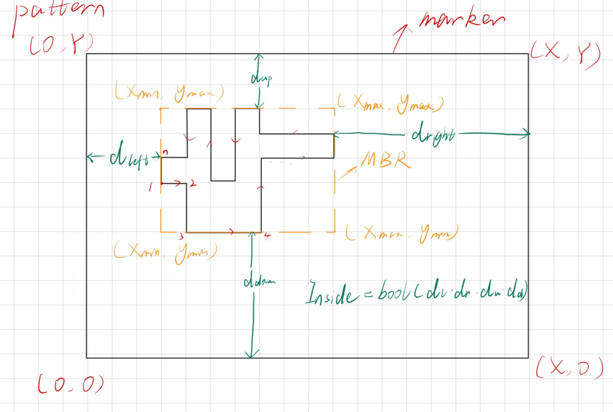
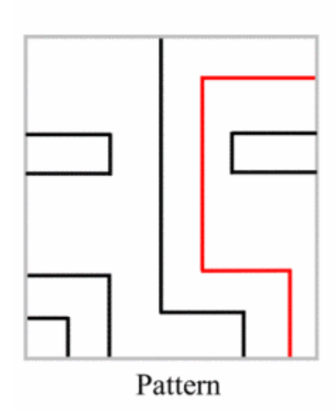

## 数据预处理
### pattern
- marker边界：$`X,Y`$
#### layer：
（排个序？count（inside=1）降序，max(n)降序，max(BDR)降序）
- 是否存在inside=1的图形
- n最大的图形
- BDR最大的图形  

##### 曼哈顿图形
（排序？inside降序，n降序，BDR降序）
**每个图形存储数据：
- 原始坐标？
- 顶点个数n
- 边向量$`v_1,v_2,……,v_i=<x_{i+1}-x_i,y{i+1}-y_i>,……,v_n`$（环形式储存？）
- MBR（最小边界矩形，Minimum Bounding Rectangle): $`x_{min},y_{min},x_{max},y_{max}`$
- 四个方向离marker的最小距离：$`d_{left},d_{right},d_{up},d_{down}`$
- 是否完全在marker内：布尔变量$`Inside=bool（d_{left}*d_{right}*d_{up}*d_{down}）`$
	* if （inside=0） 去掉marker上的边，拆分  

### layout
#### layer
##### 曼哈顿图形
- 原始坐标？
- 顶点个数n
- MBR（最小边界矩形，Minimum Bounding Rectangle): $`x_{min},y_{min},x_{max},y_{max}`$
- 边向量$`v_1,v_2,……,v_i=<x_{i+1}-x_i,y{i+1}-y_i>,……,v_n`$（环形式储存？）
- 是否空心：布尔变量hole=是否存在两个相同的坐标点
	* if （hole=1）分解内外边，去除重复点
## 确定潜在匹配区域
#### layer
##### 如果layer内存在inside=1的曼哈顿图形
- 搜索所有inside=1曼哈顿图形中n最大且MBR最大的（边向量完全相同）
	* 找到集合P：选其中一个元素定位marker，检查其他匹配，
		- 匹配，记录marker，检查其他所有层
		- 不匹配，按P下一个中下一个元素查找
##### inside全为0的layer
- 搜索边拆分后边数m最大且原MBR最大的边向量组(拆分前曼哈顿图形顶点数为$`n_0`$)
	* max（m）>3 : layout顶点数大于$n_0$的曼哈顿图形中搜索包含边向量组的情况
		-  找到集合P：选其中一个元素定位marker，检查其他匹配，
			* 匹配，记录marker，检查其他所有层
			* 不匹配，按P下一个中下一个元素查找
	* max（m）<=3 : 搜索MBR最大的曼哈顿图形包含边向量组的情况
		-  找到集合P：选其中一个元素定位marker，检查其他匹配，
			* 匹配，记录marker，检查其他所有层
			* 不匹配，按P下一个中下一个元素查找

